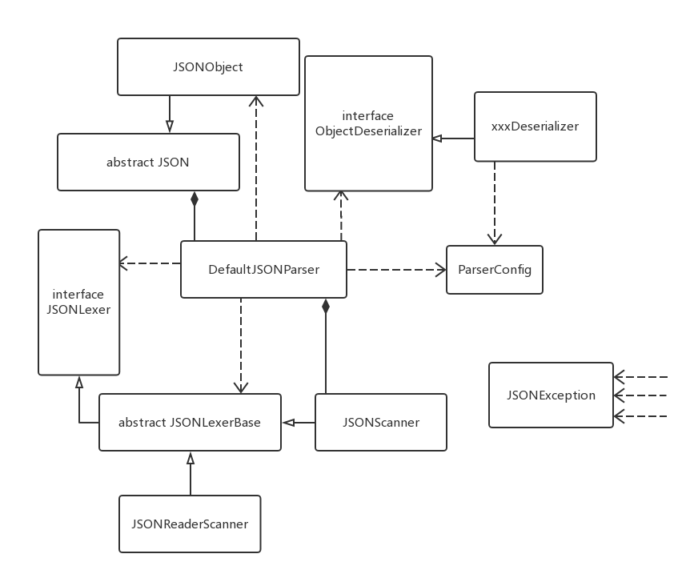
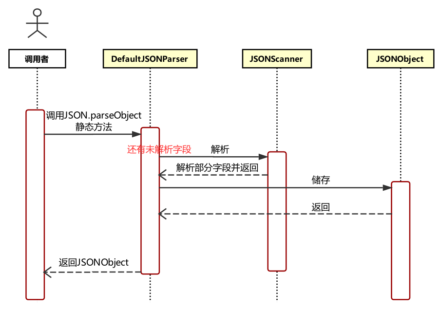
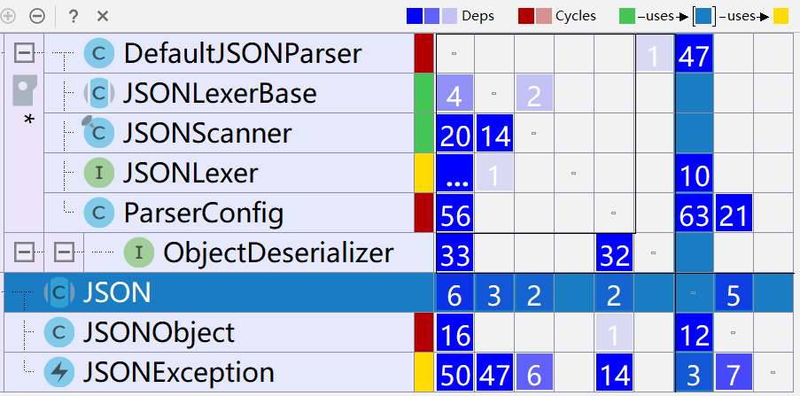

# 三. 核心流程设计分析

        上一节我们对反序列化JSON对象进行了需求建模，并探索了其在Fastjosn中的具体执行流程，本节我们将会完成对该过程在Fastjson中所涉及到的类及类间关系的分析。

## 0. 类间关系

        我们先给出需求建模中涉及到的类在Fastjson中的对应：



```text
Parser  ----> DefaultJSONParser
Lexer   ----> JSONScanner
Storage ----> JSONObject
```



        下面给出类间关系总览：



        为了进一步地抽象化和模块化，Fastjson额外实现了一些接口和类。图中的JSON抽象类是入口类，它提供了大量的静态方法；JSONObject类用于存储返回对象，继承自JSON抽象类；DefaultJSONParser类是解析器，它依赖于JSONObject类、JSONLexer接口、JSONLexerBase抽象类、ObjectDeserializer接口、ParserConfig类，并组合到JSON类上；ObjectDeserializer接口提供了泛型的支持，它通过xxxDeserializer类的具体实现返回特定类型xxx的对象；ParserConfig类进行配置信息的配置和处理，它被分离出来是因为对泛型的支持使得解析器的配置信息变得太过复杂；JSONSCanner类和JSONReaderScanner类实现了JSONLexerBase抽象类，该流程中真正被使用的是JSONScanner类，它组合到DefaultJSONParser类上；JSONException类表达了异常信息，且被大量的类所依赖，因此单独画出。

        在这当中，面向对象思想的核心要素被体现得淋漓尽致，包括抽象、继承、关联和多态。

        可以看出，除了必要的对抽象类和接口类的继承外，当一个类要使用另一个类时，都尽量使用了关联（更确切的说是组合）的关系，这是符合组合/聚合复用原则的良好设计。ObjectDeserializer接口的引入使得能够更好地扩展其他的xxxDeserializer类，JSONLexer接口和JSONLexerBase抽象类的引入也使得能够更好地扩展词法分析器，这符合开闭原则。类的职责约定（例如ParserConfig类的分离）和接口的设计是符合单一职责原则和接口隔离原则的。


组合/聚合复用原则：尽量使用组合/聚合达到复用而非继承。

开闭原则：面向扩展开放，面向修改关闭。

单一职责原则：每一个类应该只做一件事情。

接口隔离原则：应当提供尽可能小的单独接口，而不是提供大的集成接口。


        而且其中的组合关系也体现了执行流程，当调用者调用JSON类的接口函数时，一个DefaultJSON Parser对象被创建出来，它进一步创建出了JSONScanner对象、JSONObject对象以完成解析、存储，从而最终完成反序列化。不过JSONObject对象应该被返回给调用者，它具有比DefaultJSONParser对象更长的生命周期。

        当然这里也有我觉得不太合理的设计，作为入口类的JSON，其中几乎所有的方法都是静态方法，可它却被声明成一个抽象类，被JSONObject类继承。但实际上真正继承的只有其中的极小部分，静态方法并不会被继承，这里的架构个人觉得并不合适。

## 1. 时序图

        下面画出了执行流程的时序图，为了不使其过于繁杂，其中省略了xxxDeserializer类和ParserConfig类。



## 2. DSM

        接下来我们使用IntelliJ IDEA的DSM分析工具对这几个类进行分析：（\(m, n\)位置上的数字表明第n列的类多少次依赖于第m行的类）



        由于xxxDeserializer类过多，图中也略去，只体现了ObjectDeserializer接口。在选择JSON入口类后，可以看到，JSON被大量的类所依赖，换言之，顶层类被底层类大量地依赖，从而导致了循环依赖，这是不合理的。另一方面，JSON类使用DefaultJSONParser类来完成反序列化，却还要依赖于JSONLexer类和ParserConfig类，这表明其反序列化部分没有很好的封装和模块化。而且个人认为更合理的是仅依赖于一个反序列化接口，而非依赖具体实现，这才符合依赖倒置原则和开闭原则。总而言之，从DSM来看，架构并不合理。


依赖倒置原则：实现尽量依赖抽象，不依赖具体实现。


