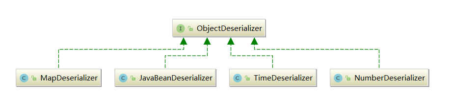

# 四. 高级设计意图分析

        完成了需求建模和对类间关系的分析，我们进入到对设计模式探索中。虽然本节的要求还包括分析面向对象设计原则，但这已经被包含在上一节的类与类间关系的设计分析中，此处不再赘述。

## 0. 单例模式


**单例模式**

**意图：**保证一个类仅有一个实例，并提供一个访问它的全局访问点。

**主要解决：**一个全局使用的类被频繁地创建与销毁。

**应用场景：**需要控制实例数目、节省系统资源的时候。

**如何解决：**只创建一个实例，且不销毁。


        考虑到Fastjson对快速处理的需求，当大量的序列化/反序列化请求同时到达时，对某些对象（如Deserializer）频繁的创建和销毁会带来不小的开销，我们猜测为了减小这部分不必要的开销，Fastjson很可能使用了单例模式。

        事实上我们可以很容易地找到它，它就在我们之前未涉足过的xxxDeserializer类中，我们选取其一进行分析：



```java
public class MapDeserializer implements ObjectDeserializer {
    public static MapDeserializer instance = new MapDeserializer();

    public <T> T deserialze(DefaultJSONParser parser, Type type, Object fieldName) {
        ...
    }
    ...
}
```



        它实现了ObjectDeserializer接口，重写了deserialze方法（此处Fastjson中存在拼写错误）以完成对JSON字符串表示的Map对象的反序列化。它在类加载时进行初始化，是典型的饿汉式的单例模式实现。其应用场景也十分鲜明，是为了节省反复创建和销毁的系统开销。

        外部对MapDeserializer类的访问是如下进行的：



```java
public <T> T parseObject(Type type, Object fieldName) {
    ...
    ObjectDeserializer derializer = config.getDeserializer(type);
    ...
    return (T) derializer.deserialze(this, type, fieldName);
}
```



        当调用者调用了支持泛型的parseObject函数时，它通过ParserConfig类的实例config取得MapDeserializer类的实例，然后调用其deserialze方法进行对应类型的反序列化，最终返回对应类型的对象。而config.getDeserializer是这样实现的：



```java
public ObjectDeserializer getDeserializer(Type type) {
    ObjectDeserializer derializer = this.deserializers.get(type);
    ...
}
```



        其中this.deserializers是ParserConfig类中的成员变量：



```java
private final IdentityHashMap<Type, ObjectDeserializer> deserializers =
    new IdentityHashMap<Type, ObjectDeserializer>();
```



        它是一个哈希表，通过get方法可以使用Type得到对应的反序列化器，它在该类的对象被创建时初始化。

        事实上我们可以发现，ParserConfig类也应用了单例模式：



```java
public static ParserConfig global = new ParserConfig();
public static ParserConfig getGlobalInstance() {
    return global;
}
```



        并通过静态方法获取实例。这里的应用场景很容易理解，与之前介绍的MapDeserializer类是一样的，是为了节省反复创建和销毁的系统开销。之所以选取MapDeserializer类进行详细介绍，是因为它包含更多的细节。

## 1. 代理模式


**代理模式**

**意图：**为客户类提供一种代理以控制对委托类的访问。

**主要解决：**在直接访问对象时存在问题**。**

**应用场景：**远程代理、虚代理、保护代理、智能指引。

**如何解决：**增加中间层。


        首先我们看以下例子：



```java
import com.alibaba.fastjson.*;

public interface ITest
{
    public int a = 1;
    public int getA();
    public void setA(int a);
}

public class CTest implements ITest
{
    public int a = 1;
    @Override
    public int getA()
    {
        return a;
    }
    public void setA(int a)
    {
        this.a = a;
    }
}

public class Test
{
    public static void main(String[] args)
    {
        CTest c = new CTest();
        String s = JSON.toJSONString(c);
        ITest i = JSON.parseObject(s, ITest.class);
        System.out.println("a: " + i.getA());
        i.setA(10);
        System.out.println("a: " + i.getA());
    }
}
```



        输出结果是：



```java
a: 1
a: 10
```



        注意到ITest接口类中并没有getA和setA方法的具体实现，在较早版本的Java中也不允许这样做，可是我们却可以调用这两个方法得到正确结果。这是因为Fastjson使用了代理模式解决了这个问题。

        当我们调用parseObject方法将JSON字符串反序列化成一个接口类的对象时，由于接口类没有get和set方法的具体实现，我们无法get和set类中的值。另一方面，一个接口类无法实例化出对象。因此Fastjson实际上通过动态代理创建并返回了一个代理对象，具体如下：



```java
public Object createInstance(DefaultJSONParser parser, Type type) {
    if (type instanceof Class) {
        if (clazz.isInterface()) {
            Class<?> clazz = (Class<?>) type;
            ClassLoader loader = Thread.currentThread().getContextClassLoader();
            final JSONObject obj = new JSONObject();
            Object proxy = Proxy.newProxyInstance(loader, new Class<?>[] { clazz },
                                                  obj);
            return proxy;
        }
    }
    ...
}
```



        当反序列化的目标是一个接口类时，实际上一个JSONObject对象被创建以存储键值对，然后通过动态代理，调用newProxyInstance创建并返回了一个代理对象。在JSONObject类中重写了invoke方法，使得其可以拦截get和set方法，以解决接口类无法get和set的问题。如下：



```java
public Object invoke(Object proxy, Method method, Object[] args) throws Throwable {
    ...
}
```



        此处之所以省略，是因为该函数本身较长，实现上也乏善可陈，想来读者也没有耐心一行行看下去，如果读者有兴趣的话，可以在JSONObject.java的第396行找到它。

        总而言之，通过代理对象+JSONObject对象来实现反序列化接口类对象，其实是一种虚拟化。而通过代理对象来完成对JSONObject对象的访问则是使用了代理模式。

        这不是代理模式的传统应用场景，却是代理模式的另一种合理应用。Fastjson通过代理模式完美地解决了这个问题。

## 2. 策略模式


**策略模式**

**意图：** 定义一系列的算法,把它们一个个封装起来, 并且使它们可相互替换。

**主要解决：**在有多种算法相似的情况下，使用 if-else 难以维护。

**应用场景：**一个系统有许多许多类，而区分它们的只是它们直接的行为。

**如何解决：**将这些算法封装成一个一个的类，任意地替换。


        回顾第三节中的类及类间关系图，我们详细地列出ObjectDeserializer接口类及其部分实现：



        实际上还有很多其他的类也实现了ObjectDeserializer接口，ObjectDeserializer接口类中只有两个方法：



```java
public interface ObjectDeserializer {
    <T> T deserialze(DefaultJSONParser parser, Type type, Object fieldName);
    int getFastMatchToken();
}
```



        它的子类重写了这两个方法，这是策略模式典型的应用场景。通过策略模式使得架构清晰且符合开闭原则，我们可以很容易增加新的特定类型反序列化器。

