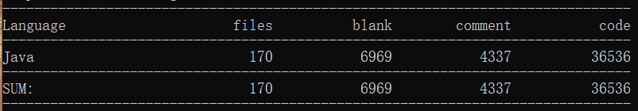
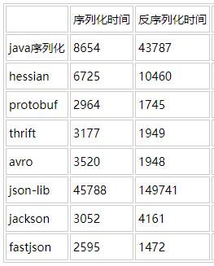

# 一. Fastjson简介

## 0. 什么是JSON？

        **JSON**（**J**ava**S**cript **O**bject **N**otation，JavaScript对象表示法）是一种由道格拉斯·克罗克福特构想和设计、轻量级的数据交换语言，该语言以易于让人阅读的文字为基础，用来传输由属性值或者序列性的值组成的数据对象。尽管JSON是JavaScript的一个子集，但JSON是独立于语言的文本格式，它不局限于 Java Script，但当前很多编程语言都支持 JSON 格式数据的生成和解析。

> [https://zh.wikipedia.org/wiki/JSON](https://zh.wikipedia.org/wiki/JSON)

        JSON具有广泛的应用，通过JSON，我们可以将对象持久化、可以通过网络进行对象的通信、可以在不同程序设计语言间传递对象等等。 如果读者不了解JSON，大可不必担心，文中涉及到对JSON的使用时会做必要介绍。如果读者希望进一步了解JSON，此处提供JSON的中文官网供参考：[json-zh](http://www.json.org/json-zh.html)。

## 
1. 什么是Fastjson？ 

        Fastjson是阿里巴巴的一个开源项目，在GitHub上开源，使用Apache 2.0协议。它是一个支持Java Object和JSON字符串互相转换的Java库。

        使用cloc工具对其进行代码量统计，如下：



        可见这是一个规模不小的项目。

## 2. Fastjson有什么特点？

（1） 顾名思义，Fastjson最大的特点在于它的快速，它超越了JackJson、Gson等库。据官方发布的说明，Fastjson从2011年fastjson发布1.1.x版本之后，其性能从未被其他Java实现的JSON库超越。因此这是Java中的JSON库的不二选择。

（2） Fastjson功能强大，支持Java Object、Map、Date、Enum等的序列化和反序列化，支持泛型，支持流式处理，支持序列化和反序列化的扩展处理，支持对无源码Java Object的序列化。

（3） 仅依赖于JDK，能够直接运行在Java SE 5.0以上版本，支持Android。

（4）使用广泛，在2012年被开源中国评选为最受欢迎的国产开源软件之一。

（5）经过完备的测试。

（6）简洁的API。



```java
String text = JSON.toJSONString(obj);        // 序列化
VO vo = JSON.parseObject("{...}", VO.class); // 反序列化
```



> [https://github.com/alibaba/fastjson/wiki/Quick-Start-CN](https://github.com/alibaba/fastjson/wiki/Quick-Start-CN)

## 3. Fastjson到底有多快？

         使用[https://github.com/eishay/jvm-serializers/](https://github.com/eishay/jvm-serializers/)提供的程序进行测试，得到如下结果：



        可以看到，Fastjson无论序列化还是反序列化，都拔得头筹。如果读者感兴趣其为何如此之快，可以参照温少的[Fastjson内幕](https://wenshao.iteye.com/blog/1142031)这篇文章，本文并不会涉及。值得一提的是，温少也是Fastjson项目的开发者之一，同时负责了阿里巴巴的诸多开源项目。

> [https://wenshao.iteye.com/blog/1142031](https://wenshao.iteye.com/blog/1142031)

## 4. 怎么使用Fastjson？

        Fastjson的源码可以从GitHub上获取，本文基于1.2.49版本，它的下载链接是：[fastjson\_1.2.49](https://github.com/alibaba/fastjson/tree/1.2.49)。最新的版本可以从[fastjson](https://github.com/alibaba/fastjson)获取。您也可以访问[fastjson\_wiki](https://github.com/alibaba/fastjson/wiki)获取Fastjson的jar文件及相关资料，或者通过[maven](http://repo1.maven.org/maven2/com/alibaba/%20fastjson/)获取。

        Fastjson API入口类是com.alibaba.fastjson.JSON，常用的操作都可以用JSON类上的静态方法直接完成。下面是一些常用API的示例。如果读者需要其他API，可以自行在JSON类中搜索。



```java
public static String toJSONString(Object object);
// 将Java Object序列化成JSON字符串
public static final JSONObject parseObject(String text);
// 将JSON字符串反序列化为Java Object
public static <T> T parseObject(String text, Class<T> clazz);
// 将JSON字符串反序列化为泛型T
```



        以下是一个简单的示例：



```java
import com.alibaba.fastjson.*;

class UserInfo
{
    private String name;
    private int age;
    public void setName(String name)
    {
        this.name = name;
    }
    public String getName()
    {
        return name;
    }

    public void setAge(int age)
    {
        this.age = age;
    }
    public int getAge()
    {
        return age;
    }
}

public class Test
{
    public static void main(String[] args)
    {
        UserInfo userInfo = new UserInfo();
        userInfo.setName("SBZeng");
        userInfo.setAge(20);
        // 将对象转换为JSON字符串
        String str = JSON.toJSONString(userInfo);
        System.out.println("JSON = " + str);
        // 将JSON字符串转换为对象
        UserInfo obj = JSON.parseObject(str, UserInfo.class);
        System.out.println("Object = name: " + obj.getName() + 
                           ", age: " + obj.getAge());
    }
}
```



        输出结果为：



```java
JSON = {"age":20,"name":"SBZeng"}
Object = name: SBZeng, age: 20
```



